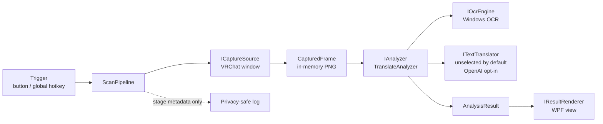

# VRChat Visual Assistant — Design

Status: MVP implementation baseline

Last updated: 2026-08-11 (Asia/Tokyo)

## 1. Problem

VRChat の海外製ワールドで看板、説明、ギミック、注意書きの英語を理解したいとき、現在は文字を別端末や別アプリへ手入力する必要がある。この摩擦のため、翻訳できる状況でも実際には諦めやすい。

本プロジェクトの中心価値は高度な画像解析そのものではなく、次の操作を短く確実にすることにある。

> 見ている英語を選ぶ → 1 回 SCAN → 数秒後に日本語で読む

## 2. Environment confirmed on 2026-08-11

| Item | Confirmed state | Consequence |
| --- | --- | --- |
| Repository | Public GitHub repository on `main` with granular initial commits | Continue using small commits and inspect every public push |
| Linux side | WSL2, Ubuntu 24.04.4 LTS | Documentation, Git, text editing, and platform-neutral tests can be managed from WSL |
| Windows side | 64-bit Windows build 26200 | The shipping process must run natively on Windows |
| .NET | Windows .NET SDK 8.0.422 and Windows Desktop runtime installed; no Linux .NET SDK | Build and run through `dotnet.exe`/PowerShell; CI uses Windows runners |
| Windows SDK / Visual Studio | Not installed as standalone components | Prefer SDK-style projects and the Windows-targeted .NET TFM's WinRT references; avoid requiring Visual Studio for MVP |
| VR software | VRChat, Steam, SteamVR, and VRChat Creator Companion installed | Native capture and later OpenVR/OSC tests are possible on this PC |
| Headset / overlay | Meta Quest 3S PCVR; XSOverlay already installed | Validate the WPF result window through XSOverlay before writing a custom OpenVR renderer |
| GPU | NVIDIA RTX 4060 Laptop GPU plus Intel UHD | No NPU was detected; do not depend on Windows AI OCR APIs that require an NPU |
| Translation load test | A GPU-resident local model added about 3.7 GB VRAM and took 4.54 s cold / about 1.05 s warm | Remove GPU-based local translation from the project; favor a capped cloud free tier for PCVR |
| Windows OCR languages | Japanese recognizer available; English recognizer not currently installed | Detect recognizers at startup, prefer `en`, fall back to the user-profile engine, and explain how to install English OCR if needed |
| GitHub CLI | Authenticated as `Na2ki-BB`; Git uses a GitHub-provided noreply author address | Public pushes can proceed without exposing the owner's regular email |

### WSL / Windows boundary

WSL is appropriate for source management, review, Git, and Markdown. The following must be run on Windows because they use HWND, GDI, WPF, WinRT OCR, global hotkeys, or SteamVR/OpenVR:

- VRChat window discovery and capture
- Windows OCR smoke tests
- WPF result rendering
- global hotkey registration
- SteamVR Overlay and controller integration
- end-to-end tests against a running VRChat instance

The source stays in the current WSL workspace. Windows commands access it through WSL interop. If a tool rejects UNC paths, the documented fallback is a Windows-side clone; generated build output is never committed.

## 3. Use cases

### Primary MVP use case

1. The user runs VRChat and VRChat Visual Assistant on Windows.
2. The user looks at English text in the current VRChat view.
3. The user presses the SCAN hotkey (or the visible SCAN button while testing).
4. The assistant captures the visible VRChat desktop window frame once.
5. Local OCR extracts text.
6. A configured translation provider translates the extracted text to Japanese.
7. The desktop result window displays the source and Japanese translation.

### Operational use cases

- The user can tell whether failure occurred during trigger, capture, OCR, translation, or rendering.
- The user can test OCR from an explicitly selected local image without running VRChat.
- The user can use a fake translator in automated tests without network access or secrets.
- A developer can add another analyzer or translation provider without changing capture or rendering code.

### Later use cases

- Trigger SCAN from an Avatar Expression Menu through official VRChat OSC.
- Show translation in a SteamVR overlay, then attach it relative to a controller/hand pose.
- Add OCR-only, multilingual translation, VQA, summarization, puzzle hints, object recognition, and opt-in web search.

## 4. MVP scope

### Included

- Windows desktop application targeting .NET 8
- Visible SCAN button and a configurable global keyboard hotkey
- One-shot capture of the visible VRChat window frame using DWM physical-pixel bounds
- In-memory PNG frame; no image is written by default
- Local OCR using `Windows.Media.Ocr`
- English-to-Japanese translation behind an `ITextTranslator` interface
- No default translation backend while provider evaluation is in progress; external sending is disabled
- Optional OpenAI Responses API text translator behind explicit provider selection
- WPF result view showing state, source text, Japanese text, and actionable errors
- Cancellation/single-flight behavior so repeated triggers cannot create request storms
- Privacy-conscious file logging without captured images, OCR text, translations, or secrets
- Unit tests for the platform-neutral pipeline and HTTP translation response handling
- Windows CI build/test and public-repository hygiene

### Explicitly not in the MVP

- DLL injection, memory reading, hooks inside VRChat, client modification, or anti-cheat interaction
- Continuous capture, recording, passive monitoring, automatic image upload, or telemetry
- SteamVR overlay or wrist-relative HUD
- Native SteamVR controller action bindings
- Avatar package/Unity asset generation
- OCR bounding-box selection UI, perspective correction, or advanced preprocessing
- Image/VQA analysis, free-form questions, web search, or puzzle-solving
- macOS, Linux, standalone Quest, or non-SteamVR runtime support
- Bundling, downloading, or running a GPU-based local translation model

## 5. Feasibility findings

### Trigger

- **MVP: global hotkey.** Win32 `RegisterHotKey` works outside the focused WPF window and does not touch the VRChat process. It is the fastest way to validate the whole pipeline.
- **Recommended next trigger: VRChat OSC avatar parameter.** VRChat officially supports OSC input/output. With OSC enabled, VRChat sends parameter changes to port 9001 by default. A custom unsaved/unsynced Boolean such as `VRCVA/Scan` can be exposed as an Expression Menu button and observed at `/avatar/parameters/VRCVA/Scan`. This is natural in VR but requires an uploaded/configured avatar.
- **Later alternative: SteamVR/OpenVR input action.** It avoids avatar dependency and can be controller-bindable, but requires an OpenVR application manifest, action manifest, bindings, runtime lifecycle, and more device testing.
- Do not emulate VRChat controls or modify its input pipeline.

### Capture

- **MVP: capture the visible VRChat window frame from the Windows desktop.** DWM extended-frame bounds provide physical-pixel coordinates independent of display scaling, then `Graphics.CopyFromScreen`/GDI performs a one-shot bit-block copy. It is easy to diagnose and sufficient while the VRChat mirror window is visible and not minimized.
- Known limits: a minimized, occluded, protected, or partially off-screen window cannot be captured reliably through the simple GDI path. HDR can also change expected colors.
- **Upgrade path:** `Windows.Graphics.Capture` supports display/window capture and is the preferred robust Windows API, but requires Direct3D frame-pool plumbing and user/system capture affordances. Introduce it after OCR/translation UX is validated.
- The MVP captures the desktop mirror, not the headset compositor's independent eye texture. This is intentional and should be tested against the user's VRChat mirror configuration.

### OCR

- **MVP: legacy `Windows.Media.Ocr.OcrEngine`.** It is local, does not need an API key, and works on ordinary Windows systems. English should be preferred when installed; the implementation reports available recognizers and falls back to the profile recognizer.
- The newer Windows App SDK AI Text Recognition API is not selected because Microsoft documents that it runs only on devices with an NPU, and this development machine has no detected NPU.
- A Tesseract backend remains a viable plug-in if Windows OCR accuracy is insufficient. It adds a native engine, trained-data distribution, license inventory, and preprocessing work.
- A cloud Vision OCR backend may improve difficult in-world text, but it would upload the captured image and therefore must be an explicit opt-in provider with a clear data boundary.

### Translation

- **Current default: unselected.** `VRCVA_TRANSLATION_PROVIDER` defaults to `none`; the app returns an actionable configuration failure and sends no OCR text externally.
- Azure Translator F0, DeepL API Developer, Google Cloud Translation, Amazon Translate, and offline Argos/OPUS-MT have been researched but not selected or implemented as the default.
- **Optional: OpenAI Responses API.** It is enabled only with `VRCVA_TRANSLATION_PROVIDER=openai` and reads only the application-specific `VRCVA_OPENAI_API_KEY`. The generic `OPENAI_API_KEY` fallback was removed to prevent accidental reuse and spend.
- The OpenAI request sends OCR text only and uses `store: false`. The UI states both the external data boundary and metered usage.
- Provider responses and HTTP bodies are never logged. Tests use fake HTTP handlers and placeholder keys.

### Renderer

- **Phase 1:** ordinary WPF window. This makes source text, translation, timing, and errors visible during development.
- **Phase 1.5 (selected for this environment): XSOverlay Window Capture.** The installed XSOverlay can expose the existing WPF window inside SteamVR. This gives a testable Quest 3S in-VR panel without maintaining a second renderer.
- **Phase 2:** validate optional XSOverlay notification integration or VRChat OSC triggering based on measured UX.
- **Phase 3 fallback:** implement a custom OpenVR overlay only if XSOverlay cannot provide acceptable placement or interaction. Valve's `IVROverlay` supports absolute or tracked-device-relative transforms.

## 6. Implementation alternatives

### Application architecture options

| Option | Strengths | Weaknesses | Decision |
| --- | --- | --- | --- |
| A. C#/.NET 8 + WPF + Win32/WinRT + provider adapters | Best balance for HWND capture, WPF UI, async HTTP, global hotkey, tests, and maintainability; Windows Desktop runtime already installed | OpenVR C# bindings may need a maintained interop layer later; WinRT contracts must be restored | **Selected for MVP** |
| B. C++20 + Win32/C++/WinRT + native OpenVR | Direct access to Direct3D and Valve's native API; strongest long-term overlay control | Highest implementation and memory-safety cost; slower UI/API iteration; standalone Windows SDK/toolchain missing | Reconsider for a small overlay host only if C# interop blocks Phase 2 |
| C. Rust core + Tauri/web UI or Python/TypeScript process | Good ecosystem for HTTP/AI (Python/TS) or memory safety (Rust); rapid prototypes | More runtime/packaging pieces; weaker first-party WinRT/WPF/OpenVR path; IPC and distribution complexity before user value | Not selected |

### OCR/capture variants

| Variant | Capture | OCR | Privacy | Complexity | Use |
| --- | --- | --- | --- | --- | --- |
| Provider pending | GDI visible window | Windows OCR; translation disabled | Pixels and OCR text stay local | Low | **Now** |
| Robust Windows | Windows.Graphics.Capture | Windows OCR or Tesseract | Local unless cloud explicitly enabled | Medium | After vertical slice |
| Vision cloud | Windows.Graphics.Capture | Cloud vision/LLM | Image leaves device | Low code, higher policy/cost burden | Opt-in fallback only |

## 7. Recommended architecture



### Project boundaries

```text
src/
  VrcVa.Core/             platform-neutral contracts, result types, ScanPipeline
  VrcVa.Infrastructure/   translator adapters and protocol parsing
  VrcVa.Windows/          WPF shell, Win32 capture/hotkey, WinRT OCR, composition root
tests/
  VrcVa.Core.Tests/
  VrcVa.Infrastructure.Tests/
```

The project count is deliberately small. OpenVR should initially be another renderer/trigger adapter, not a rewrite of the core pipeline.

### Core contracts

- `IScanTrigger`: emits an explicit user-requested scan.
- `ICaptureSource`: returns one `CapturedFrame`; implementations own platform APIs.
- `IAnalyzer`: turns one frame and request context into an `AnalysisResult`.
- `IOcrEngine`: extracts source text from a frame.
- `ITextTranslator`: translates text without knowing about images or renderers.
- `IResultRenderer`: renders progress, success, or failure.
- `ScanPipeline`: enforces stage order, cancellation, correlation ID, timings, and error classification.

`TranslateAnalyzer` is a thin composition of `IOcrEngine` and `ITextTranslator`. Future analyzers may bypass OCR, use multiple providers, or return richer typed payloads without changing capture or trigger code.

## 8. Data flow and lifecycle

1. Trigger produces a `ScanRequest` with a new correlation ID and timestamp.
2. The pipeline rejects or cancels overlapping work according to single-flight policy.
3. Capture locates a non-minimized `VRChat.exe` main window, resolves its DWM physical-pixel frame, and copies visible pixels into memory.
4. OCR decodes the in-memory frame and extracts English-like text. Empty OCR is a typed, user-actionable failure.
5. Translation receives normalized text only. It has a timeout, cancellation token, bounded output, and explicit provider errors.
6. Renderer updates the WPF UI on the dispatcher thread.
7. Frame buffers are disposed as soon as analysis completes. No image is retained.
8. Logs record correlation ID, stage, duration, dimensions/text length, and sanitized errors—not content.

Failure categories are stable UI concepts: `Trigger`, `CaptureTargetNotFound`, `CaptureUnavailable`, `OcrUnavailable`, `NoTextDetected`, `TranslationNotConfigured`, `TranslationFailed`, `Cancelled`, and `Unexpected`.

## 9. Security, privacy, and public-repository policy

- Never inject code, load a DLL into VRChat, patch files, read process memory, bypass EAC, or depend on non-public VRChat APIs.
- Capture only after an explicit click/hotkey/OSC edge. There is no timer-based capture loop.
- Keep frame bytes in memory and dispose them. Debug image export is disabled by default and, if later added, must require an explicit user action and write only to a documented local directory.
- Capture and OCR are local. No OCR text leaves the PC in the default unselected state. Any future cloud provider or image-upload analyzer must have an unmistakable UI disclosure and explicit opt-in configuration.
- Do not log images, OCR text, translations, Authorization headers, request bodies, environment variables, user IDs, avatar IDs, or world names.
- Keep secrets in environment variables or OS secret storage. `.env`, local settings, captures, logs, dumps, publish output, and IDE metadata are ignored by Git.
- CI never receives a production API key. Network-backed tests use fake HTTP handlers.
- Before each public push: inspect `git diff --cached`, run a secret-pattern scan, confirm no generated captures/logs, then commit.
- Brand the project as unofficial and avoid implying VRChat or Valve endorsement.
- Re-check VRChat Terms and supported OSC docs before shipping a release because service rules can change.

## 10. GitHub management baseline

- Default branch: `main`.
- Public repository: `Na2ki-BB/vrchat-visual-assistant`; local `main` tracks `origin/main`.
- CI: Windows runner, restore/build/test with no secrets.
- Dependabot: weekly NuGet and GitHub Actions checks.
- Include `SECURITY.md`, contribution guidance, issue templates, and a pull-request template.
- Do not choose an open-source license silently. Public visibility does not itself grant reuse rights; add a license only after the owner selects one.
- Use feature branches and draft PRs once the remote exists; protect `main` after the first successful CI run.

## 11. Phased delivery

### Phase 0 — research and scaffold

Environment inventory, official API review, design, task plan, Git/public hygiene.

### Phase 1 — testable vertical slice

WPF SCAN button/global hotkey → visible VRChat window capture → local OCR → explicit provider boundary → desktop result. Provider selection remains a gate; keep file-input OCR diagnostics and automated tests usable meanwhile.

### Phase 1.5 — Quest 3S + XSOverlay vertical slice

Capture the existing WPF result window in XSOverlay, place it in VR, trigger SCAN through the overlay button, and measure readability and interaction. This is now the shortest route to the requested in-VR result because XSOverlay is already installed.

### Phase 1.6 — real-device hardening

Measure latency and OCR accuracy in representative worlds. Add selectable crop/center ROI, scaling/contrast preprocessing, capture-provider fallback, retry UX, and configurable hotkey only when measurements justify them.

### Phase 2 — natural in-VR trigger

Add a localhost-only OSC listener for an avatar parameter with rising-edge/debounce behavior. Document the required Expression Menu parameter. Keep the keyboard trigger as recovery path.

### Phase 3 — custom VR rendering fallback

Implement an OpenVR overlay renderer only if the XSOverlay evaluation exposes material limitations, first head-locked/dashboard-style, then controller-relative. Keep WPF diagnostics available.

### Phase 4 — analyzer expansion

Add typed analyzer selection and explicit data-boundary indicators for OCR-only, multilingual translation, VQA, summarization, puzzle hints, object recognition, and opt-in web search.

## 12. Decision log

| Date | Decision | Reason |
| --- | --- | --- |
| 2026-08-11 | Start with an external Windows app, not a VRChat mod | Complies with the non-invasive requirement and avoids client/EAC risk |
| 2026-08-11 | Select C#/.NET 8 + WPF | Best total fit for installed environment, Win32/WinRT, GUI, HTTP, tests, and maintainability |
| 2026-08-11 | Use visible-window GDI capture before Windows.Graphics.Capture | Smallest diagnosable one-shot capture path; upgrade boundary is isolated |
| 2026-08-11 | Resolve capture bounds with DWM rather than DPI-virtualized client coordinates | A 150%+ display-scale fixture proved that logical client coordinates crop the frame; DWM returned the correct physical 2564×1504 bounds |
| 2026-08-11 | Keep OCR local and send text only for translation | Strong privacy default without blocking translation quality |
| 2026-08-11 | Use hotkey first, official VRChat OSC next | Proves value with no avatar work; OSC later gives native in-VR interaction through a supported interface |
| 2026-08-11 | Defer OpenVR overlay until the desktop vertical slice is measured | Overlay work should not hide capture/OCR/translation failures |
| 2026-08-11 | Use installed XSOverlay for the first Quest 3S in-VR result test | Its supported Window Capture can display the existing WPF app, avoiding custom OpenVR work before UX validation |
| 2026-08-11 | Label OpenAI translation as metered API use | Local capture/OCR are free to run, but API translation is not; the user must not encounter surprise cost |
| 2026-08-11 | Defer translation-provider selection and default to no external sending | The owner is still comparing cost, latency, privacy, and PCVR impact; implementation must wait for an explicit decision |
| 2026-08-11 | Remove GPU-based local translation from the project | A local benchmark consumed about 3.7 GB additional VRAM on an 8 GB laptop GPU and risks PCVR contention |
| 2026-08-11 | Require an app-specific key for optional OpenAI mode | Removing the generic `OPENAI_API_KEY` fallback prevents another tool's key from silently enabling paid calls |
| 2026-08-11 | Do not add a license yet | License choice belongs to the repository owner |

## 13. Official sources reviewed

All sources below were checked on 2026-08-11.

- VRChat OSC overview and ports: <https://docs.vrchat.com/docs/osc-overview>
- VRChat OSC avatar parameters and generated config behavior: <https://docs.vrchat.com/docs/osc-avatar-parameters>
- VRChat Expression Menu controls: <https://creators.vrchat.com/avatars/expression-menu-and-controls/>
- VRChat Terms of Service (effective 2026-02-09), including client modification restrictions: <https://hello.vrchat.com/legal>
- Microsoft screen capture guidance: <https://learn.microsoft.com/en-us/windows/apps/develop/media-authoring-processing/screen-capture>
- Microsoft Windows AI OCR guidance and NPU requirement: <https://learn.microsoft.com/en-us/windows/ai/apis/text-recognition>
- Microsoft `Graphics.CopyFromScreen` API: <https://learn.microsoft.com/en-us/dotnet/api/system.drawing.graphics.copyfromscreen>
- Valve OpenVR API overview: <https://github.com/ValveSoftware/openvr/wiki/API-Documentation>
- Valve `IVROverlay` overview: <https://github.com/ValveSoftware/openvr/wiki/IVROverlay_Overview>
- Steamworks SteamVR overlay apps: <https://partner.steamgames.com/doc/features/steamvr/info>
- Tesseract official repository and license: <https://github.com/tesseract-ocr/tesseract>
- Tesseract OCR quality guidance: <https://github.com/tesseract-ocr/tessdoc/blob/main/ImproveQuality.md>
- OpenAI Responses API quickstart: <https://platform.openai.com/docs/quickstart/make-your-first-api-request>
- OpenAI current model catalog: <https://developers.openai.com/api/docs/models>
- OpenAI `gpt-5.6-luna` pricing: <https://developers.openai.com/api/docs/models/gpt-5.6-luna>
- OpenAI API key handling: <https://developers.openai.com/api/reference/overview#authentication>
- Azure Translator F0 pricing: <https://azure.microsoft.com/en-us/pricing/details/cognitive-services/translator/>
- Azure Translator REST usage and secret handling: <https://learn.microsoft.com/en-us/azure/ai-services/translator/text-translation/how-to/use-rest-api>
- Azure Translator service limits and latency: <https://learn.microsoft.com/en-us/azure/ai-services/translator/service-limits>
- DeepL API plans: <https://support.deepl.com/hc/en-us/articles/360021200939-DeepL-API-plans>
- Google Cloud Translation pricing: <https://cloud.google.com/translate/pricing>
- Amazon Translate pricing: <https://aws.amazon.com/translate/pricing/>
- Argos Translate offline engine: <https://github.com/argosopentech/argos-translate>
- OPUS-MT English-to-Japanese model: <https://huggingface.co/Helsinki-NLP/opus-mt-en-jap>
- XSOverlay Steam page and Window Capture capability: <https://store.steampowered.com/app/1173510/XSOverlay/>
- Microsoft guidance for calling WinRT APIs from .NET desktop apps: <https://learn.microsoft.com/en-us/windows/apps/desktop/modernize/winrt-apis-desktop-apps>
