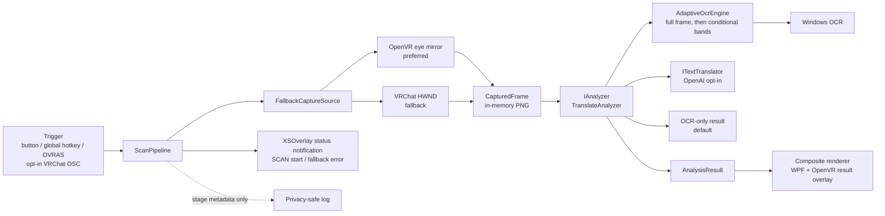

# VRChat Visual Assistant — Design

Status: MVP implementation baseline

Last updated: 2026-08-14 (Asia/Tokyo)

## 1. Problem

VRChat の海外製ワールドで看板、説明、ギミック、注意書きの英語を理解したいとき、現在は文字を別端末や別アプリへ手入力する必要がある。この摩擦のため、翻訳できる状況でも実際には諦めやすい。

本プロジェクトの中心価値は高度な画像解析そのものではなく、次の操作を短く確実にすることにある。

> 見ている英語を選ぶ → 1 回 SCAN → 数秒後に日本語で読む

## 2. Environment confirmed on 2026-08-11

| Item | Confirmed state | Consequence |
| --- | --- | --- |
| Repository | Public GitHub repository on `main` with granular initial commits | Continue using small commits and inspect every public push |
| Linux side | WSL2, Ubuntu 24.04.4 LTS | Documentation, Git, text editing, and platform-neutral tests can be managed from WSL |
| Windows side | 64-bit Windows build 26200 | The shipping process must run natively on Windows |
| .NET | Windows .NET SDK 8.0.422 and Windows Desktop runtime installed; no Linux .NET SDK | Build and run through `dotnet.exe`/PowerShell; CI uses Windows runners |
| Windows SDK / Visual Studio | Not installed as standalone components | Prefer SDK-style projects and the Windows-targeted .NET TFM's WinRT references; avoid requiring Visual Studio for MVP |
| VR software | VRChat, Steam, SteamVR, and VRChat Creator Companion installed | Native capture and later OpenVR/OSC tests are possible on this PC |
| Headset / overlay | Meta Quest 3S PCVR; XSOverlay and OVR Advanced Settings installed | Use XSOverlay's local notification endpoint for results and OVRAS keyboard actions for controller-trigger experiments; do not require a captured WPF panel |
| GPU | NVIDIA RTX 4060 Laptop GPU plus Intel UHD | No NPU was detected; do not depend on Windows AI OCR APIs that require an NPU |
| Translation load test | A GPU-resident local model added about 3.7 GB VRAM and took 4.54 s cold / about 1.05 s warm | Remove GPU-based local translation from the project; favor a capped cloud free tier for PCVR |
| Windows OCR languages | Japanese recognizer available; English recognizer not currently installed | Detect recognizers at startup, prefer `en`, fall back to the user-profile engine, and explain how to install English OCR if needed |
| GitHub CLI | Authenticated as `Na2ki-BB`; Git uses a GitHub-provided noreply author address | Public pushes can proceed without exposing the owner's regular email |

### WSL / Windows boundary

WSL is appropriate for source management, review, Git, and Markdown. The following must be run on Windows because they use HWND, Direct3D/Windows Graphics Capture, WPF, WinRT OCR, global hotkeys, or SteamVR/OpenVR:

- VRChat window discovery and capture
- Windows OCR smoke tests
- WPF result rendering
- global hotkey registration
- SteamVR Overlay and controller integration
- end-to-end tests against a running VRChat instance

The source stays in the current WSL workspace. Windows commands access it through WSL interop. If a tool rejects UNC paths, the documented fallback is a Windows-side clone; generated build output is never committed.

## 3. Use cases

### Primary MVP use case

1. The user runs VRChat and VRChat Visual Assistant on Windows.
2. The user looks at English text in the current VRChat view.
3. The user presses the SCAN hotkey, or an OVR Advanced Settings controller binding sends that hotkey.
4. The assistant captures the VRChat desktop window frame once. If it was minimized, the app restores it only for capture and returns it to minimized state afterward.
5. Local OCR extracts text.
6. With no provider, OCR text is the successful local-only result. A configured translation provider instead translates it to Japanese.
7. The result is sent to the desktop diagnostic view and the persistent OpenVR result panel. XSOverlay carries only short progress/fallback notices.

### Operational use cases

- The user can tell whether failure occurred during trigger, capture, OCR, translation, or rendering.
- The user can test OCR from an explicitly selected local image without running VRChat.
- The user can use a fake translator in automated tests without network access or secrets.
- A developer can add another analyzer or translation provider without changing capture or rendering code.

### Later use cases

- Trigger SCAN from an Avatar Expression Menu through official VRChat OSC.
- Show translation in a SteamVR overlay, then attach it relative to a controller/hand pose.
- Add OCR-only, multilingual translation, VQA, summarization, puzzle hints, object recognition, and opt-in web search.

## 4. MVP scope

### Included

- Windows desktop application targeting .NET 8
- Visible SCAN button and a configurable global keyboard hotkey
- One-shot OpenVR eye-mirror capture with HWND-targeted Windows Graphics Capture fallback
- In-memory PNG frame; no image is written by default
- Local OCR using `Windows.Media.Ocr`, with a conditional full-view multi-band retry
- English-to-Japanese translation behind an `ITextTranslator` interface
- No-key startup defaults to local OCR; the selected OpenAI provider requires an explicit VRCVA credential
- Optional OpenAI Responses API text translator behind explicit provider selection
- WPF result view showing state, source text, Japanese text, and actionable errors
- Cancellation/single-flight behavior so repeated triggers cannot create request storms
- Privacy-conscious file logging without captured images, OCR text, translations, or secrets
- Best-effort localhost XSOverlay notifications for progress, OCR/translation result, and failure stage
- Persistent HMD-relative OpenVR result panel with explicit interaction toggle, scrolling, and close
- Automatic restore/capture/re-minimize behavior when the VRChat desktop window was minimized
- Unit tests for the platform-neutral pipeline and HTTP translation response handling
- Windows CI build/test and public-repository hygiene

### Explicitly not in the MVP

- DLL injection, memory reading, hooks inside VRChat, client modification, or anti-cheat interaction
- Continuous capture, recording, passive monitoring, automatic image upload, or telemetry
- Wrist-relative HUD placement
- Native SteamVR controller action bindings
- Avatar package/Unity asset generation
- OCR bounding-box selection UI, perspective correction, or advanced preprocessing
- Image/VQA analysis, free-form questions, web search, or puzzle-solving
- macOS, Linux, standalone Quest, or non-SteamVR runtime support
- Bundling, downloading, or running a GPU-based local translation model

## 5. Feasibility findings

### Trigger

- **MVP: global hotkey.** Win32 `RegisterHotKey` works outside the focused WPF window and does not touch the VRChat process. It is the fastest way to validate the whole pipeline.
- **Phase 1.5 controller bridge: OVR Advanced Settings.** Its documented SteamVR actions can send configured keyboard shortcuts from a controller. `Keyboard Shortcut Two` maps to SCAN and `Keyboard Shortcut Three` maps to the nano/Luna toggle. This avoids the observed XSOverlay pointer failure and requires no VRChat/avatar modification.
- **Current Phase 2 trigger: VRChat OSC avatar parameter advertised through OSCQuery.** A custom unsaved/unsynced Boolean `VRCVA_Scan` is exposed as an Expression Menu button. VRCVA uses Windows-assigned dynamic ports instead of 9001 because installed XSOverlay already occupies it. Windows DNS-SD rejects a strict loopback service registration, so the sockets are registered on Windows network interfaces while every OSC/HTTP callback rejects senders that are neither loopback nor one of this PC's own addresses; `HOST_INFO.OSC_IP` remains `127.0.0.1`.
- **Later alternative: SteamVR/OpenVR input action.** It avoids avatar dependency and can be controller-bindable, but requires an OpenVR application manifest, action manifest, bindings, runtime lifecycle, and more device testing.
- Do not emulate VRChat controls or modify its input pipeline.

### Capture

- **Current primary: one OpenVR compositor eye mirror.** Normal SCAN uses `GetMirrorTextureD3D11` for the configured eye, left by default. It selects the compositor GPU through `IVRSystem.GetOutputDevice(TextureType_DirectX)`, reads one adopted frame into the existing in-memory `CapturedFrame`, and never starts SteamVR as a side effect.
- The result overlay itself is the capture gate. Every primary capture must hide it, confirm `IsOverlayVisible == false`, cross three compositor boundaries, acquire and discard the first mirror view, cross one more boundary, and only then adopt the next view. Quest 3S proved that removing the discard can reintroduce the previous result and create a self-OCR loop.
- **Fallback: VRChat HWND with Windows Graphics Capture.** `FallbackCaptureSource` uses this existing path when OpenVR initialization, interface lookup, GPU selection, or copy fails. The frame is cropped to the Win32 client rectangle so the title bar is excluded. A minimized VRChat window is restored without activation for this fallback only, then returned to minimized state.
- The adopted source is visible in the WPF details and SteamVR result-panel title. Cancellation never starts the fallback path. Both sources remain one explicit in-memory capture with no automatic image output.

#### OpenVR compositor eye-mirror feasibility and Stage 1 diagnostic

The path is technically feasible on the current Windows + SteamVR architecture, but it is a medium-sized capture backend rather than a small change to `OpenVrInterop`.

- Valve's current `IVRCompositor_029` exposes `GetMirrorTextureD3D11(Eye_Left/Eye_Right, deviceOrResource, shaderResourceView)` and describes the result as an undistorted composited image for one eye. The returned view must be released with `ReleaseMirrorTextureD3D11`, not ordinary COM `Release`.
- The D3D11 device must use the compositor's GPU. Resolve it through `IVRSystem.GetOutputDevice(TextureType_DirectX)` (adapter LUID; `GetDXGIOutputInfo` is the older index path), create the D3D11 device on that adapter, copy the mirror resource to a CPU-readable staging texture, and convert/encode it into the existing in-memory `CapturedFrame` boundary.
- Start with one configurable eye and compare left/right on Quest 3S before choosing a default. Stereo stitching would add cost and parallax artifacts and is not required for the first vertical slice.
- Because Valve calls this a *composited* eye image, our result overlay may be present in the mirror. This is an inference from the official API wording and must be confirmed on-device. The capture contract must execute `HideOverlay` first, verify `IsOverlayVisible == false`, then cross at least one compositor boundary with `WaitFrameSync` before calling `GetMirrorTextureD3D11`. The existing Trigger-stage hide occurs before Capture and is the correct ordering, but the future backend must make this synchronization an explicit invariant and test that a distinctive synthetic result panel never appears in the captured frame.
- Introduce a `FallbackCaptureSource`: try the compositor source only while SteamVR and the required interfaces are already available; on initialization/interface/device/copy failure, fall back to the existing `VrChatWindowCaptureSource`. Do not launch SteamVR as a side effect. Cancellation and privacy semantics remain one explicit in-memory capture with no automatic file output.
- `VR_Init`/`VR_ShutdownInternal` ownership must be shared or reference-counted. The current result panel owns one OpenVR lifetime; a second independent capture lifetime could shut the runtime down underneath the renderer.
- Estimated implementation size: 4–7 production files plus diagnostics/tests, roughly 350–650 lines. Estimate 2–4 engineering days for interop, D3D11 readback, fallback, and automated coverage, plus a separate Quest 3S device-validation session for FOV, eye choice, overlay exclusion, latency, and GPU impact.

Required official APIs: `IVRSystem.GetOutputDevice` (or legacy `GetDXGIOutputInfo`), `IVRCompositor.GetMirrorTextureD3D11`, `IVRCompositor.ReleaseMirrorTextureD3D11`, `IVROverlay.HideOverlay`, `IVROverlay.IsOverlayVisible`, and `IVROverlay.WaitFrameSync`.

##### Stage 1 feasibility spike (2026-08-12)

The diagnostic-only spike succeeds on the owner's Quest 3S + SteamVR + RTX 4060 Laptop system without entering `ICaptureSource` or changing normal SCAN behavior. `IVRSystem_026.GetOutputDevice(TextureType_DirectX)` returned adapter LUID `0x0000000000012F22`; a D3D11 device on that adapter acquired both `IVRCompositor_029` eye mirrors. Each eye was `3072×3352`, exposed as a `Texture2D` SRV with `DXGI_FORMAT_R8G8B8A8_UNORM_SRGB`. An initial no-save run measured the cropped VRChat window at `2560×1299`, so the eye source had 1.20× the horizontal pixels and 2.58× the vertical pixels in that run.

Single-eye `GetMirrorTextureD3D11` plus GPU staging readback was typically 24–28 ms in repeated no-save runs. The current window diagnostic took about 2.4 seconds including window capture and PNG encoding, so that number is not a like-for-like raw GPU-copy comparison. A coarse whole-GPU sample at 250 ms intervals measured 39.3% average GPU and 4193 MiB VRAM before the diagnostic versus 35.5% and 4193 MiB while it ran; this establishes no observed short-sample regression, not a final performance guarantee.

The overlay-exclusion test found an important runtime behavior: after `HideOverlay`, `IsOverlayVisible == false`, and three `WaitFrameSync` boundaries, the first mirror acquisition still contained the distinctive test panel. Discarding that acquisition, crossing one more compositor boundary, and acquiring again returned zero marker signal for both eyes. The capture invariant therefore includes a mandatory throwaway mirror acquisition after hiding; analyzing the first acquisition would permit a self-OCR loop. The mirror view is released only with `ReleaseMirrorTextureD3D11`, while the separately obtained D3D resource follows normal COM ownership.

The owner-supervised, controller-triggered visual run completed while the HMD reported `UserInteraction`. It again returned `3072×3352` for each eye; the current window was `2560×1600`, giving the eye source 1.20× the horizontal and 2.10× the vertical pixels. Left and right acquisition plus staging readback took 48.9 ms and 33.2 ms respectively in this sequential run. These individual values include ordering and warm-up effects and are not used to choose an eye.

The current window image clipped both the heading and a substantial lower block of the tall test sign. Both eye images contained the sign from its upper heading through its lower end, confirming the intended vertical-FOV improvement. The left eye placed the target text closer to the image center, so Stage 2 should use the left eye by default while keeping the choice configurable. The distinctive overlay marker was absent from both adopted frames (`hidden=0` for each eye), confirming the discard-and-wait exclusion contract on this device. The explicitly approved diagnostic images were inspected only for these properties and then permanently deleted; no image or scene text was copied into the repository or logs.

The diagnostic never saves by default. Explicit `--save-eye-mirror <directory>` export remains an owner-controlled troubleshooting option. Stage 1 is complete and its measured invariants are retained by Stage 2.

##### Stage 2 capture backend and adaptive OCR scaling (2026-08-12)

Stage 2 promotes a configurable single eye to the primary `ICaptureSource` and retains `VrChatWindowCaptureSource` behind a platform-neutral `FallbackCaptureSource`. `OpenVrRuntime` remains process-wide and reference counted, so disposing the per-scan compositor lease cannot shut down the result panel's lease. A deterministic synthetic-marker test fixes the exact hide/boundary/discard/boundary/adopt order; cancellation and unexpected programming failures are not silently converted into fallback success.

The 3072×3352 eye frame also required an OCR pixel budget. Sources below 8,000,000 pixels keep the previously validated Cubic upscale up to 2×, constrained to 16,777,216 output pixels and `OcrEngine.MaxImageDimension`. Sources at or above that roughly-4K threshold use 1×. Derived bands retain their parent frame as the scale reference, so splitting a high-resolution eye image cannot turn 2× back on. Band cropping is performed at 1× and OCR scaling is applied exactly once; `BitmapTransform` uses the documented scale-then-crop order, including scaled crop coordinates.

On the same owner-supervised tall-sign scene, the eye frame was 3072×3352 and the window frame 2560×1600. Eye OCR changed from 4,649.1 ms with legacy 2× to 1,210.1 ms with adaptive 1× while retaining 33 lines and 638 ASCII letters/digits. Forced three-band OCR changed from 6,265.4 ms to 2,761.7 ms and recognized 60 lines/1,168 ASCII letters/digits versus 59/1,158. The window result was identical between modes: 24 lines/498 ASCII letters/digits for the full path and 36/748 for forced bands; timing differences were small (1,638.2 vs 1,482.4 ms full, 2,644.2 vs 2,705.6 ms bands). This validates the 8 MP threshold for the measured sources: it removes harmful eye upscaling without changing the lower-resolution window result.

Production SCAN on Quest 3S completed through the left eye at 3072×3352 with capture/total pairs of 1,203/2,208 ms and 916/1,689 ms. The matched diagnostic window path took 2,530.7 ms to capture plus 1,638.2 ms for OCR, versus 1,081.3 + 1,210.1 ms through the eye, a roughly 45% capture-plus-OCR reduction. A trigger-correlated 250 ms GPU sample measured 56.1% average and 4,416 MiB immediately before SCAN versus 61.4% and 4,424 MiB during its 1.53-second interval. The short increase is about 5.3 percentage points and 8 MiB, with no sustained worker after completion.

With SteamVR stopped, the production composition reached `VrChatWindowCaptureSource` and did not start `vrserver`. A locally staged, self-authored `VRChat.exe` fixture then completed through `FallbackCaptureSource` as `VRChatウィンドウ（フォールバック）`, and the fixture OCR check recognized its two synthetic lines. The final check matched its 640×360 client rectangle at the machine's 200% desktop scale; the test now derives this expected size from `GetClientRect` instead of assuming one DPI. Staging the fixture into `%TEMP%` avoids Windows network-executable warnings from the WSL UNC path; the process and uniquely named temporary directory are removed after the check.

### OCR

- **MVP: legacy `Windows.Media.Ocr.OcrEngine`.** It is local, does not need an API key, and works on ordinary Windows systems. English should be preferred when installed; the implementation reports available recognizers and falls back to the profile recognizer.
- At startup, the WPF shell always shows the available recognizer tags. If no `en`/`en-*` recognizer exists, it shows a prominent but non-blocking Japanese warning before the first scan, because a Japanese profile fallback can turn English into plausible-looking Han characters and full-width punctuation.
- **Current accuracy fallback:** first OCR the complete frame. If fewer than 80 ASCII letters/digits are found, split the complete view into three overlapping horizontal bands and recognize each band. Frames below 8 MP retain the validated Cubic upscale up to 2×; high-resolution frames stay at 1×, and all paths obey a 16.8 MP output budget. The final text is the union of primary-first and band-only lines; conservative, occurrence-aware approximate matching removes OCR variations caused by band overlap while retaining repeated lines within one observation.
- **Windows device validation on 2026-08-12:** for the same self-authored six-line image, `OcrResult.Text` returned one flattened line while `OcrResult.Lines` returned all six physical lines. A four-line, sub-threshold image changed from four flattened candidate blocks before the fix to individual lines after it, so union/dedup now receives line-sized inputs. Severe band-edge fragments remain separate by design when they exceed the conservative edit-distance threshold.
- **Interpolation comparison on that six-line image:** unscaled OCR misread `DOOR` and `TWO`; Fant 2x also lost the leading word `FOLLOW`; Cubic 2x retained `DOOR` and `FOLLOW` and only misread `TWO`. The implementation therefore uses the shared Cubic transform for both full-frame and band paths; the decision was based on recognized content, with exact-line counts (4/6, 3/6, 5/6 respectively) recorded only as a secondary check.
- The newer Windows App SDK AI Text Recognition API is not selected because Microsoft documents that it runs only on devices with an NPU, and this development machine has no detected NPU.
- A Tesseract backend remains a viable plug-in if Windows OCR accuracy is insufficient. It adds a native engine, trained-data distribution, license inventory, and preprocessing work.
- A cloud Vision OCR backend may improve difficult in-world text, but it would upload the captured image and therefore must be an explicit opt-in provider with a clear data boundary.

### Translation

- **Current opt-in provider: OpenAI Responses API.** Local OCR remains the no-key default so a fresh installation sends nothing externally. An explicitly stored VRCVA credential selects OpenAI automatically; the environment alternative requires `VRCVA_TRANSLATION_PROVIDER=openai` plus the application-specific `VRCVA_OPENAI_API_KEY`. The generic `OPENAI_API_KEY` fallback was removed to prevent accidental reuse and spend.
- Azure Translator F0, DeepL API Developer, Google Cloud Translation, Amazon Translate, and offline Argos/OPUS-MT were researched but are not selected or implemented.
- A key registered in the UI is stored as the Generic Credential `VrcVa/OpenAIApiKey` by Windows Credential Manager. It is not written to repository files or logs and is decryptable only in the same Windows user context; this is not isolation from another process already running as that user. Environment variables remain a non-persistent override.
- The OpenAI request sends OCR text only and uses `store: false`. The UI states both the external data boundary and metered usage.
- The request uses a fixed translation-only instruction, no tools, `reasoning.effort=none`, no automatic retries, a 1,200-token output ceiling, and a timeout configurable from 1 to a hard maximum of 25 seconds.
- Application-side spend guards reject inputs above 4,000 UTF-8 bytes and reject API attempt 11 and later in one process before network I/O. Failed network attempts consume the session allowance so repeated provider failures cannot create an unbounded loop. Restarting the process resets this allowance, so a dedicated OpenAI Project hard spend limit remains the account-level backstop.
- Runtime model IDs are allowlisted to `gpt-5.6-luna` and `gpt-5.4-nano`; an arbitrary environment-supplied model cannot bypass the documented price envelope.
- When OpenAI is enabled, the WPF UI exposes runtime selection between the recommended/default `gpt-5.6-luna` and `gpt-5.4-nano`. `Ctrl+Shift+G` or the OVRAS controller bridge toggles the same state and confirms it through an XSOverlay notification. A change applies to the next scan and is disabled during an active scan.
- Model selection is session-only and contains no secret. Startup still follows `VRCVA_OPENAI_MODEL`, defaulting to Luna, while the API key remains process-scoped and is never displayed or persisted.
- Provider responses and HTTP bodies are never logged. Tests use fake HTTP handlers and placeholder keys.
- An owner-supervised Quest 3S PCVR session completed 10/10 OpenAI translations after credential-backed startup. Total SCAN latency was 1.59–6.70 seconds (median 3.04, mean 3.40); source lengths were 29–627 characters. Attempt 11 and later were classified as `TranslationUsageLimitReached` before API I/O, confirming the per-process guard without logging source or translated content.

### Renderer

- **Phase 1:** ordinary WPF window. This keeps full source text, translation, timing, and errors visible during development.
- **Phase 1.5 (superseded for normal progress/results): XSOverlay notifications.** UDP submission has no display acknowledgement and device use showed that a notification may appear late. XSOverlay therefore remains only a best-effort error fallback. The WPF view remains a parallel diagnostic renderer.
- **Rejected for normal use: XSOverlay Window Capture of the WPF app.** Real-device evaluation found too many setup interactions, an oversized panel, and a controller-click failure. It is no longer part of the normal instructions.
- **Phase 1.7 (selected after notification feedback): VRCVA-owned OpenVR result overlay.** Initialize only while SteamVR is already running and present the latest result over the scene until the user closes it or starts another scan. The panel automatically takes laser input while visible, accepting that VRChat movement pauses during reading in exchange for zero interaction bindings. Closing, hiding for the next scan, disconnecting, or disposing clears interaction. Placement defaults to the left controller and can switch to the right controller or HMD on the desktop. Position and width calibration then occurs inside VR through large laser targets, with explicit save, reset, and cancel actions. A missing selected controller falls back to the established HMD-relative transform for ordinary results and prevents an ineffective calibration session.
- **Current capture:** prefer one OpenVR compositor eye mirror with automatic window fallback. Phase 2 adds the separate opt-in OSCQuery trigger without changing this capture path.

## 6. Implementation alternatives

### Application architecture options

| Option | Strengths | Weaknesses | Decision |
| --- | --- | --- | --- |
| A. C#/.NET 8 + WPF + Win32/WinRT + provider adapters | Best balance for HWND capture, WPF UI, async HTTP, global hotkey, tests, and maintainability; Windows Desktop runtime already installed | OpenVR C# bindings may need a maintained interop layer later; WinRT contracts must be restored | **Selected for MVP** |
| B. C++20 + Win32/C++/WinRT + native OpenVR | Direct access to Direct3D and Valve's native API; strongest long-term overlay control | Highest implementation and memory-safety cost; slower UI/API iteration; standalone Windows SDK/toolchain missing | Reconsider for a small overlay host only if C# interop blocks Phase 2 |
| C. Rust core + Tauri/web UI or Python/TypeScript process | Good ecosystem for HTTP/AI (Python/TS) or memory safety (Rust); rapid prototypes | More runtime/packaging pieces; weaker first-party WinRT/WPF/OpenVR path; IPC and distribution complexity before user value | Not selected |

### OCR/capture variants

| Variant | Capture | OCR | Privacy | Complexity | Use |
| --- | --- | --- | --- | --- | --- |
| Provider pending | OpenVR eye mirror with window fallback | Windows OCR; translation disabled | Pixels and OCR text stay local | High | **Now** |
| Window fallback | Windows Graphics Capture | Windows OCR | Pixels and OCR text stay local | Medium | Automatic when OpenVR is unavailable |
| Vision cloud | Windows.Graphics.Capture | Cloud vision/LLM | Image leaves device | Low code, higher policy/cost burden | Opt-in fallback only |

## 7. Recommended architecture



### Project boundaries

```text
src/
  VrcVa.Core/             platform-neutral contracts, result types, ScanPipeline
  VrcVa.Infrastructure/   translator adapters and protocol parsing
  VrcVa.Windows/          WPF shell, Win32 capture/hotkey, WinRT OCR, composition root
tests/
  VrcVa.Core.Tests/
  VrcVa.Infrastructure.Tests/
  VrcVa.Windows.Tests/
```

The project count is deliberately small. OpenVR remains a Windows adapter behind `ICaptureSource` and `IResultRenderer`, not a rewrite of the core pipeline.

### Core contracts

- Button, hotkey, and OSC adapters converge on the WPF composition root, which creates a `ScanRequest`; there is no separate trigger contract in Core.
- `ICaptureSource`: returns one `CapturedFrame`; implementations own platform APIs.
- `IAnalyzer`: turns one frame and request context into an `AnalysisResult`.
- `IOcrEngine`: extracts source text from a frame.
- `IOcrRegionSource`: creates temporary in-memory views used only by the conditional OCR retry.
- `ITextTranslator`: translates text without knowing about images or renderers.
- `IResultRenderer`: renders progress, success, or failure.
- `ScanPipeline`: enforces stage order, cancellation, correlation ID, timings, and error classification.

`TranslateAnalyzer` is a thin composition of `IOcrEngine` and `ITextTranslator`. Future analyzers may bypass OCR, use multiple providers, or return richer typed payloads without changing capture or trigger code.

## 8. Data flow and lifecycle

1. Button, hotkey, or an armed OSC inactive→active edge produces a `ScanRequest` with a new correlation ID and timestamp. OSC is disabled by default, accepts only the configured address/type/value, resets its armed state on `/avatar/change`, and never queues a trigger while another scan is active.
2. The pipeline rejects or cancels overlapping work according to single-flight policy.
3. Capture first tries the configured OpenVR eye while SteamVR is already running. It hides and drains the result overlay, discards one stale mirror acquisition, adopts the next, and encodes one in-memory PNG. Any OpenVR acquisition failure falls back to the `VRChat.exe` HWND path; a minimized window is restored only for this fallback.
4. OCR first decodes the complete in-memory frame using a scale selected from root dimensions and output-pixel budget. A weak result triggers three overlapping, full-width band passes across the entire view; primary and band-only lines are unioned with conservative approximate deduplication, and temporary band buffers are disposed immediately. An empty result remains a typed, user-actionable failure.
5. With provider `none`, OCR text becomes the result immediately. Otherwise translation receives normalized text only, with timeout, cancellation, bounded output, and explicit provider errors.
6. A composite renderer updates the WPF diagnostic UI and the VRCVA-owned OpenVR overlay. OSC shows a preloaded acknowledgement immediately, changes to capture after one second, hides for the eye acquisition, then shows OCR progress and the result. Results persist until explicit close or the next scan and automatically enable close/page interaction while visible. All hide/close/error paths clear that state. XSOverlay is reserved for best-effort error fallback.
7. Frame buffers are disposed as soon as analysis completes. No image is retained.
8. Logs record correlation ID, stage, duration, dimensions/text length, and sanitized errors—not content.

Failure categories are stable UI concepts: `Trigger`, `CaptureTargetNotFound`, `CaptureUnavailable`, `OcrUnavailable`, `NoTextDetected`, `TranslationNotConfigured`, `TranslationFailed`, `Cancelled`, and `Unexpected`.

## 9. Security, privacy, and public-repository policy

- Never inject code, load a DLL into VRChat, patch files, read process memory, bypass EAC, or depend on non-public VRChat APIs.
- Opt-in OSC uses DNS-SD link-local advertisement, so the service name and dynamic ports are visible on the LAN. Windows will not register a DNS-SD service bound only to loopback; callbacks therefore apply a local-host address allowlist before parsing or responding, and OSCQuery tells VRChat to send OSC to `127.0.0.1`. Raw packets, sender addresses, and `/avatar/change` values are never logged.
- Capture only after an explicit click/hotkey/OSC edge. There is no timer-based capture loop.
- Keep frame bytes in memory and dispose them. Debug image export is disabled by default and, if later added, must require an explicit user action and write only to a documented local directory.
- Capture and OCR are local. No OCR text leaves the PC in the default unselected state. Any future cloud provider or image-upload analyzer must have an unmistakable UI disclosure and explicit opt-in configuration.
- XSOverlay notifications stay on the PC through `127.0.0.1`; their payload contains the displayed OCR or translation result, so another local process with access to that UDP endpoint is inside the local trust boundary.
- Do not log images, OCR text, translations, Authorization headers, request bodies, environment variables, user IDs, avatar IDs, or world names.
- Keep secrets in environment variables or OS secret storage. `.env`, local settings, captures, logs, dumps, publish output, and IDE metadata are ignored by Git.
- CI never receives a production API key. Network-backed tests use fake HTTP handlers.
- Before each public push: inspect `git diff --cached`, run a secret-pattern scan, confirm no generated captures/logs, then commit.
- Brand the project as unofficial and avoid implying VRChat or Valve endorsement.
- Re-check VRChat Terms and supported OSC docs before shipping a release because service rules can change.

## 10. GitHub management baseline

- Default branch: `main`.
- Public repository: `Na2ki-BB/vrchat-visual-assistant`; local `main` tracks `origin/main`.
- CI: Windows runner, restore/build/test with no secrets.
- Dependency security: GitHub vulnerability alerts and Dependabot security updates are enabled. Routine Dependabot version-update PRs are disabled to avoid update noise.
- Include `SECURITY.md`, contribution guidance, issue templates, and a pull-request template.
- Do not choose an open-source license silently. Public visibility does not itself grant reuse rights; add a license only after the owner selects one.
- Use feature branches and draft PRs once the remote exists; protect `main` after the first successful CI run.

## 11. Phased delivery

### Phase 0 — research and scaffold

Environment inventory, official API review, design, task plan, Git/public hygiene.

### Phase 1 — testable vertical slice

WPF SCAN button/global hotkey → HWND-targeted VRChat window capture → local OCR → explicit provider boundary → desktop result. Provider selection remains a gate; keep file-input OCR diagnostics and automated tests usable meanwhile.

### Phase 1.5 — Quest 3S + XSOverlay vertical slice

Send compact results through XSOverlay's local notification endpoint instead of capturing the WPF window. Trigger the existing hotkeys from OVR Advanced Settings controller actions, preserving desktop diagnostics and avoiding XSOverlay pointer interaction.

### Phase 1.6 — real-device hardening

Measure latency and OCR accuracy in representative worlds. Validate occluded-window capture and automatic restore/re-minimize behavior. Consider direct SteamVR compositor capture only if restore remains disruptive; add ROI, preprocessing, and retry UX only when measurements justify them.

### Phase 2 — natural in-VR trigger

The receive-only OSCQuery subset now advertises Windows-assigned OSC/HTTP ports, serves `/avatar` plus `HOST_INFO`, and accepts only a configured Bool or Int avatar parameter. A monotonic rising-edge gate allows the first press after quiet startup, while suppressing an active state observed during avatar-change settling, menu-reset duplicates, and rapid repeated triggers. It is opt-in and keeps the keyboard/OVRAS trigger as the recovery path. PCVR has confirmed VRChat auto-discovery and first-press delivery while XSOverlay continues using 9001; verification from a second LAN device that no OSCQuery response is usable remains outstanding.

### Phase 1.7 — interactive VR result panel

The XSOverlay notification evaluation exposed material limitations: fixed lifetime, no explicit close, and no long-text scrolling. The implemented VRCVA-owned OpenVR scene overlay uses the existing renderer contract, keeps a tracked-device-relative result until close/replacement, and retains WPF diagnostics and graceful fallback. It automatically takes laser input while visible and releases it on close/replacement, avoiding any separate interaction binding at the accepted cost of pausing VRChat movement during reading. The default anchor is the left controller; the right controller and HMD are selectable on the desktop. Fine-grained desktop sliders were rejected after immediate usability feedback because switching between the monitor and headset for every adjustment is impractical. A dedicated 1280×720 VR calibration texture instead provides eight large movement/size targets plus save/reset/cancel; every adjustment changes the overlay transform immediately without re-uploading its texture. Calibration deliberately uses one full texture whose dimensions match `SetOverlayMouseScale`, because device measurements showed that input Y for the 2×3 bounded atlas did not share the assumed one-third-cell mapping. This removes the mismatch rather than adding a device-specific correction. Values remain bounded and are atomically persisted as non-secret local settings only on explicit save. The controller role is resolved for every display instead of retaining a stale device index, and an unavailable selected controller uses the established HMD-relative placement for ordinary results.

The same overlay owns OSC acknowledgement and OCR progress. A fixed 2x3 atlas contains three status views and up to three result pages. `SetOverlayRaw` is used only when the atlas content changes; joystick or scrollbar navigation calls only `SetOverlayTextureBounds`. This removes the compositor image replacement that caused a visible flash on every former pixel-scroll step. Text beyond the bounded VR atlas remains complete in the WPF view.

The result close action is rendered in a dedicated column inside the known interactive body area, separate from the scrollbar. Scene overlays do not opt into SteamVR dashboard Control Bar flags. The close column intentionally ignores vertical pointer position after atlas-to-page X conversion, so compositor-specific vertical hit offsets cannot strand the user in input-capture mode.

### Phase 4 — analyzer expansion

Add typed analyzer selection and explicit data-boundary indicators for OCR-only, multilingual translation, VQA, summarization, puzzle hints, object recognition, and opt-in web search.

### Phase 3 — wrist launcher, local-first setup, and feature foundation

The next approved slice replaces the normal OVRAS/OSC launch path with a VRCVA-owned left-wrist launcher. SteamVR Input 2.0 is read with action-set priority `0`, so VRCVA observes the right trigger without suppressing VRChat's scene actions. The left joystick is absent from VRCVA's action manifest and remains dedicated to VRChat movement. The existing `MakeOverlaysInteractiveIfVisible` path is removed from ordinary result/menu use because OpenVR defines it as system-wide laser-mouse mode while the overlay is visible; that flag is the identified cause of movement loss.

VRCVA computes the right-controller ray and overlay intersection itself. Pointer position, button rectangles, rendering, and hit testing share one logical surface specification. The trigger's rising edge is accepted only while the pointer is over an enabled VRCVA control; a trigger already held when hover begins must be released before it can activate anything. Input failure disables only VRCVA interaction and never falls back to taking scene input. The same input route must serve the launcher, result pages, close button, scrollbar, and placement calibration. Joystick scrolling is retired so walking and reading do not share one physical control.

The initial device gate is `--steamvr-input-pass-through-check`: Quest 3S must report 20/20 right-trigger edges while the owner continuously walks in VRChat, with no Action Menu, OSC, OVRAS action, manual binding edit, or movement pause. Product UI promotion waits for this gate. Default Oculus Touch bindings ship with the app; this removes user-authored bindings, although SteamVR still uses a normal application binding internally. Trigger input remains visible to VRChat by design. Selectively suppressing it would require SteamVR's experimental overlay-input override and is outside this slice.

After the gate, a small non-blocking chip follows the left controller. It becomes armed only after its surface faces the HMD for 150 ms, using hysteresis to avoid flicker. The right-hand pointer expands a compact feature menu. Starting a feature immediately hides every VRCVA overlay before the existing compositor-boundary/discard capture sequence. A completed result does not enable global laser mode; closing it returns to the wrist chip. SteamVR loss, controller pose loss, cancellation, and disposal all fail open for VRChat input.

The small-group onboarding flow is local-first and has three short checks: SteamVR auto-launch registration, English OCR readiness, and optional OpenAI BYOK storage. It does not start SteamVR without consent and does not require an installer. A stable self-contained beta folder is the supported distribution shape; the first run registers its fixed executable path with SteamVR and may require one SteamVR restart before auto-launch is recognized. Later launches occur with SteamVR and stay minimized unless setup or diagnostics need the desktop window. A single-instance guard prevents a manual launch and SteamVR launch from creating two processes.

Windows Credential Manager remains the selected personal-use secret store. It gives the API key an OS-managed, per-user boundary without placing it in `settings.json`, environment files, command history, or logs. Saving or deleting a key must affect the next SCAN without restarting VRCVA. A process-lifetime quota object survives runtime reconstruction so editing settings cannot reset the ten-attempt guard. Saved OpenAI credentials are valid only for the official endpoint preset; custom endpoints require a separate future profile and credential.

Future AI features use a compile-time `FeatureCatalog`, typed feature descriptors, and shared backend/usage policy. Dynamic plug-ins, an autonomous agent loop, arbitrary tools, and a general-purpose kernel remain deferred. The second feature should reuse OCR plus the text-model boundary (for example summarization) to prove the extension point before adding image models or tools. OCR/world text is untrusted content; future tool-capable features must never interpret it as authority and must require explicit confirmation before external side effects.

The AI-development harness is stored in the repository but is not installed or enabled automatically. It consists of a concise skill, project-specific references, deterministic validation scripts, and evidence rules. Product invariants remain in source code and tests; the skill is a runbook that invokes them. Its setup document may explain how to copy or link the skill into a supported agent environment, but this project must not write to personal Codex/Claude settings, install plug-ins, or register MCP services.

#### Phase 3 implementation gates

1. Characterize the current capture, atlas, close, scrollbar, calibration, key, and no-network behavior with tests.
2. Add the Input 2.0 ABI and pass-through diagnostic; do not change normal interaction until Quest validation succeeds.
3. Move result/calibration interaction to the shared pointer contract and permanently keep global laser mode off.
4. Add the wrist chip/menu state machine and route `Translation` through the existing single-flight pipeline.
5. Add app-manifest auto-launch, single-instance behavior, versioned settings migration, and the first-run wizard.
6. Extract the feature/backend composition boundaries without changing translation output or privacy behavior.
7. Prepare and validate the uninstalled AI-development skill and its configuration instructions.
8. Run Windows build/tests/format, secret inspection, diagnostic checks, independent review, and Quest acceptance before replacing OSC/OVRAS documentation with fallback-only wording.

## 12. Decision log

| Date | Decision | Reason |
| --- | --- | --- |
| 2026-08-11 | Start with an external Windows app, not a VRChat mod | Complies with the non-invasive requirement and avoids client/EAC risk |
| 2026-08-11 | Select C#/.NET 8 + WPF | Best total fit for installed environment, Win32/WinRT, GUI, HTTP, tests, and maintainability |
| 2026-08-11 | Initially use visible-window GDI capture (superseded below) | It was the smallest diagnosable one-shot capture path before real-device occlusion feedback |
| 2026-08-11 | Initially resolve GDI bounds with DWM (superseded below) | A 150%+ display-scale fixture proved that logical client coordinates cropped the frame |
| 2026-08-11 | Keep OCR local and send text only for translation | Strong privacy default without blocking translation quality |
| 2026-08-11 | Use hotkey first, official VRChat OSC next | Proves value with no avatar work; OSC later gives native in-VR interaction through a supported interface |
| 2026-08-11 | Defer OpenVR overlay until the desktop vertical slice is measured | Overlay work should not hide capture/OCR/translation failures |
| 2026-08-11 | Initially use installed XSOverlay Window Capture for the first Quest 3S test (superseded below) | It provided the quickest first visual test before real interaction evidence existed |
| 2026-08-11 | Label OpenAI translation as metered API use | Local capture/OCR are free to run, but API translation is not; the user must not encounter surprise cost |
| 2026-08-11 | Defer translation-provider selection and default to no external sending | The owner is still comparing cost, latency, privacy, and PCVR impact; implementation must wait for an explicit decision |
| 2026-08-11 | Remove GPU-based local translation from the project | A local benchmark consumed about 3.7 GB additional VRAM on an 8 GB laptop GPU and risks PCVR contention |
| 2026-08-11 | Require an app-specific key for optional OpenAI mode | Removing the generic `OPENAI_API_KEY` fallback prevents another tool's key from silently enabling paid calls |
| 2026-08-14 | Select OpenAI Responses API as the current opt-in translation backend | Credential-backed Quest 3S PCVR use completed 10/10 translations, while no-key startup remains local OCR only and attempt 11 is blocked before API I/O |
| 2026-08-11 | Initially expose nano/Luna in the XSOverlay-visible WPF UI (superseded below) | The owner needed a runtime cost/quality choice before the Window Capture UX was evaluated |
| 2026-08-11 | Do not add a license yet | License choice belongs to the repository owner |
| 2026-08-11 | Replace XSOverlay Window Capture with localhost notifications | Device feedback showed high setup friction, excessive panel size, and broken controller clicking; notifications preserve VR visibility without a persistent window |
| 2026-08-11 | Use OVR Advanced Settings as the interim controller bridge | It is already installed and officially supports controller-bound keyboard actions, so SCAN and model toggle do not depend on XSOverlay clicks or avatar edits |
| 2026-08-11 | Auto-restore a minimized VRChat window for capture | Removes manual desktop-window management while preserving an isolated path to compositor capture later |
| 2026-08-11 | Require OSCQuery for a future OSC trigger | XSOverlay uses the usual 9001 receive port on this machine; discovery avoids fixed-port conflicts and supports multiple receivers |
| 2026-08-11 | Replace screen-coordinate GDI with HWND-targeted Windows Graphics Capture | Real-device use showed that an occluding PC window was OCRed instead of VRChat; direct window-surface capture fixes the root cause and removes the need to hide or foreground VRCVA |
| 2026-08-12 | Shorten the XSOverlay start notification from 12 seconds to 1 second | Logs showed capture and OCR usually completed in about one second, but XSOverlay queued the result behind the long progress notification |
| 2026-08-12 | Add conditional full-view multi-band OCR instead of a center-only crop | The user must be able to read long text anywhere in view without precisely centering it; conditional retry limits added latency |
| 2026-08-12 | Union primary and band OCR with conservative approximate deduplication | Preserve primary-only lines while preventing overlap variations from duplicating translation input; occurrence-aware matching retains legitimate repeated lines |
| 2026-08-12 | Crop window capture to the Win32 client rectangle | Real-device OCR included the Windows title-bar text `VRChat`; geometric exclusion fixes the capture boundary without suppressing legitimate in-world words |
| 2026-08-12 | Replace fixed-duration XSOverlay result notifications with a VRCVA-owned OpenVR result panel | Real-device use requires the result to remain readable, close on demand, and scroll through long text; the renderer boundary allows this without changing capture, OCR, or translation |
| 2026-08-12 | Keep OpenVR result placement HMD-relative before wrist placement | It proves compositor rendering and interaction with the fewest new moving parts; controller-relative calibration remains an independent follow-up |
| 2026-08-12 | Detect a missing English OCR recognizer at startup and show installation steps without blocking SCAN | Japanese profile fallback can return structurally plausible but unusable Han characters for English; users need to discover and remedy this before the first scan while retaining intentional Japanese OCR use |
| 2026-08-12 | Build OCR text from `OcrResult.Lines` instead of `OcrResult.Text` | Windows device comparison returned one flattened `.Text` line but six `Lines`; explicit joining restores the line boundary required by normalization and adaptive deduplication |
| 2026-08-12 | Upscale full-frame and band OCR with a shared 2x-bounded Cubic transform | On the same synthetic six-line image, exact recognized lines were 4/6 without scaling, 3/6 with Fant, and 5/6 with Cubic; Cubic was selected from actual recognition output |
| 2026-08-13 | Automatically enable result-overlay interaction while visible | Direct laser scroll/close needs no keyboard or controller binding; the owner accepts that VRChat movement pauses until the panel is closed |
| 2026-08-13 | Preload a VRCVA-owned status atlas and show acknowledgement directly instead of through XSOverlay | XSOverlay UDP has no display acknowledgement and real-device feedback showed that queued progress appeared only at the end; the owned overlay provides deterministic ordering and is hidden before capture |
| 2026-08-13 | Replace pixel scrolling with a fixed six-cell atlas and texture-bound page changes | Repeated `SetOverlayRaw` replaced the compositor image on every step and visibly flashed; bounds-only navigation performs no image upload and also supports direct scrollbar selection |
| 2026-08-14 | Default the result panel to a user-calibrated left-controller transform | It shortens normal reading access without adding an input binding; right-hand/HMD choices and a per-display HMD fallback keep placement recoverable |
| 2026-08-14 | Perform placement calibration inside VR instead of with desktop sliders | The user must see the panel while adjusting it; large laser targets provide immediate spatial feedback and avoid repeated headset/monitor switching |
| 2026-08-14 | Render calibration as one full logical-UI texture instead of an atlas cell | Five device measurements showed X mapping was correct but bounded-atlas Y clicks expanded about 1.5× from center; matching texture and mouse-scale dimensions removes the ambiguous bounds transform without a headset-specific correction |
| 2026-08-12 | Keep OpenVR eye-mirror capture at research status | The API is feasible, but correct GPU selection, D3D11 readback, shared OpenVR lifetime, overlay exclusion, fallback, and Quest 3S validation make it a separate medium-sized vertical slice |
| 2026-08-12 | Complete the OpenVR eye-mirror diagnostic with the left eye as the Stage 2 default candidate | Quest 3S returned 3072×3352 per eye; both eyes restored the tall sign's missing vertical content, the left kept the target nearer center, and adopted frames excluded the result overlay after a mandatory throwaway acquisition |
| 2026-08-12 | Prefer one OpenVR eye mirror and fall back to the VRChat window | The left eye restored vertical FOV and cut measured capture-plus-OCR from about 4.17 s to 2.29 s; SteamVR is never auto-started and the retained HWND path covers OpenVR acquisition failures |
| 2026-08-12 | Disable OCR upscaling at 8 MP and cap transformed output at 16.8 MP | Quest eye OCR fell from 4.65 s to 1.21 s with equal full-path coverage, while the lower-resolution window result remained identical; parent dimensions keep high-resolution bands at 1× |
| 2026-08-12 | Apply `BitmapTransform` scaling once and convert crop bounds into scaled coordinates | Microsoft documents scale before crop; the previous band transform could double-scale and made middle/lower 1× crops invalid |
| 2026-08-13 | Implement a receive-only OSCQuery subset with no new dependency | VRChat only needs the advertised `/avatar` namespace and dynamic OSC target; a full OSCQuery/WebSocket client would add unrelated surface area |
| 2026-08-13 | Register DNS-SD on Windows interfaces but reject non-local senders | Windows returned `0x8007232A` when registering a strict loopback DNS-SD socket; local-address filtering and `OSC_IP=127.0.0.1` preserve same-PC processing without falling back to fixed port 9001 |
| 2026-08-14 | Replace global overlay laser mode with priority-zero SteamVR Input 2.0 and VRCVA-owned hit testing | OpenVR permits overlay actions to be observed without suppressing the scene app unless experimental high priority is selected; this keeps VRChat walking active |
| 2026-08-14 | Use a left-wrist chip and right-hand laser instead of physical tapping | It matches the accepted XSOverlay-like interaction, avoids pose-tap tuning, and removes user-authored OVRAS/OSC bindings from normal use |
| 2026-08-14 | Keep Windows Credential Manager for small-group BYOK and apply changes without restart | It is the strongest built-in per-user store available without adding an account service, while immediate runtime refresh removes the current usability defect |
| 2026-08-14 | Use a compile-time feature catalog before considering plug-ins or an agent kernel | It gives the next OCR/text-AI feature a stable boundary without introducing third-party code loading, broad tool authority, or premature compatibility promises |
| 2026-08-14 | Prepare the AI-development harness in-repository without installing it | Repeatable agent instructions and evidence formats are useful, but personal agent configuration remains an explicit user action |

## 13. Official sources reviewed

All sources below were checked on 2026-08-11 through 2026-08-13.

- VRChat OSC overview and ports: <https://docs.vrchat.com/docs/osc-overview>
- VRChat OSCQuery and multiple-receiver discovery: <https://docs.vrchat.com/docs/oscquery>
- VRChat OSC avatar parameters and generated config behavior: <https://docs.vrchat.com/docs/osc-avatar-parameters>
- VRChat Expression Menu controls: <https://creators.vrchat.com/avatars/expression-menu-and-controls/>
- VRChat Terms of Service (effective 2026-02-09), including client modification restrictions: <https://hello.vrchat.com/legal>
- Microsoft screen capture guidance: <https://learn.microsoft.com/en-us/windows/apps/develop/media-authoring-processing/screen-capture>
- Microsoft `IGraphicsCaptureItemInterop.CreateForWindow`: <https://learn.microsoft.com/windows/win32/api/windows.graphics.capture.interop/nf-windows-graphics-capture-interop-igraphicscaptureiteminterop-createforwindow>
- Microsoft Windows AI OCR guidance and NPU requirement: <https://learn.microsoft.com/en-us/windows/ai/apis/text-recognition>
- Microsoft `BitmapTransform` scale/rotate/crop order: <https://learn.microsoft.com/en-us/uwp/api/windows.graphics.imaging.bitmaptransform>
- Microsoft `Graphics.CopyFromScreen` API: <https://learn.microsoft.com/en-us/dotnet/api/system.drawing.graphics.copyfromscreen>
- Valve OpenVR API overview: <https://github.com/ValveSoftware/openvr/wiki/API-Documentation>
- Valve OpenVR source/bindings, including compositor mirror texture access: <https://github.com/ValveSoftware/openvr>
- Valve current `openvr.h`, including `GetOutputDevice`, `GetMirrorTextureD3D11`, `ReleaseMirrorTextureD3D11`, `IsOverlayVisible`, and `WaitFrameSync`: <https://raw.githubusercontent.com/ValveSoftware/openvr/master/headers/openvr.h>
- Valve `IVROverlay` overview: <https://github.com/ValveSoftware/openvr/wiki/IVROverlay_Overview>
- Steamworks SteamVR overlay apps: <https://partner.steamgames.com/doc/features/steamvr/info>
- Tesseract official repository and license: <https://github.com/tesseract-ocr/tesseract>
- Tesseract OCR quality guidance: <https://github.com/tesseract-ocr/tessdoc/blob/main/ImproveQuality.md>
- OpenAI Responses API quickstart: <https://platform.openai.com/docs/quickstart/make-your-first-api-request>
- OpenAI current model catalog: <https://developers.openai.com/api/docs/models>
- OpenAI `gpt-5.6-luna` pricing: <https://developers.openai.com/api/docs/models/gpt-5.6-luna>
- OpenAI API key handling: <https://developers.openai.com/api/reference/overview#authentication>
- Azure Translator F0 pricing: <https://azure.microsoft.com/en-us/pricing/details/cognitive-services/translator/>
- Azure Translator REST usage and secret handling: <https://learn.microsoft.com/en-us/azure/ai-services/translator/text-translation/how-to/use-rest-api>
- Azure Translator service limits and latency: <https://learn.microsoft.com/en-us/azure/ai-services/translator/service-limits>
- DeepL API plans: <https://support.deepl.com/hc/en-us/articles/360021200939-DeepL-API-plans>
- Google Cloud Translation pricing: <https://cloud.google.com/translate/pricing>
- Amazon Translate pricing: <https://aws.amazon.com/translate/pricing/>
- Argos Translate offline engine: <https://github.com/argosopentech/argos-translate>
- OPUS-MT English-to-Japanese model: <https://huggingface.co/Helsinki-NLP/opus-mt-en-jap>
- XSOverlay Steam page and Window Capture capability: <https://store.steampowered.com/app/1173510/XSOverlay/>
- OVR Advanced Settings controller actions and keyboard-input guide: <https://github.com/OpenVR-Advanced-Settings/OpenVR-AdvancedSettings>
- Microsoft guidance for calling WinRT APIs from .NET desktop apps: <https://learn.microsoft.com/en-us/windows/apps/desktop/modernize/winrt-apis-desktop-apps>
