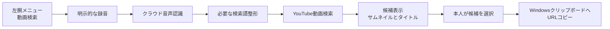

# VRChat Visual Assistant — 動画検索機能設計

Status: draft overview / not implemented

Last updated: 2026-10-01 (Etc/UTC). Requirements discussion and repository inspection only; no API or device validation.

[設計の入口](../DESIGN.md) · [共通AI基盤設計](DESIGN-PLATFORM.md) · [日本語翻訳機能設計](DESIGN-JAPANESE-TRANSLATION.md)

## Purpose and ownership

この文書は、左腕メニューから音声でYouTube動画を検索し、候補を選んでURLをWindowsクリップボードへコピーする新機能の概要案を定義する。コピーしたURLをワールドの動画プレイヤーへ貼り付ける操作は本人が行う。

現段階では、目的と大まかな操作の流れが決まっている。細かいUI、録音の終了方法、音声モデル、検索サービス、具体的なインターフェースは未決定であり、今後この文書を詳しくする。既存の翻訳設計に沿って責務ごとに整理するが、未確認の方式や性能を確定事項で埋めない。

腕メニュー、入力・歩行維持、結果パネルの配置、FeatureCatalog、共通通信、資格情報とprivacyの正本は[共通AI基盤設計](DESIGN-PLATFORM.md)。この文書は音声入力、検索語、動画候補、URLコピー、固有の外部送信範囲と未決定事項を扱う。既存のOCR・日本語翻訳は変更しない。

## Problem

VRChat内で動画を探すためにデスクトップオーバーレイを開き、ブラウザーや文字入力を操作する負担を減らしたい。動画の検索とURL取得を腕メニュー内で短く済ませ、最後の貼り付けは今までどおり本人が行う。

> 左腕の動画検索 → 話す → 候補を見る → 選ぶ → URLをコピー

目的はYouTubeをVR内で完全に操作することや、ワールドの動画プレイヤーを自動制御することではない。

## Current baseline and assumptions

| Item | Confirmed state / assumption | Consequence |
| --- | --- | --- |
| 既存の入力 | `FeatureInputKind` は `CapturedFrame` のみで、`IAnalyzer` は画像を受け取る | 音声入力は既存契約への登録だけでは実現しない |
| 既存の実行 | `ScanPipeline` はFeatureCatalogで機能を解決した後、必ず画面取得を行う | 動画検索のために無関係な画面取得やOCRを実行しない設計が必要 |
| 既存の機能 | 実行時の機能は `Translation` のみ。要約は未登録の境界検証用 | 動画検索が利用可能になったとは扱わない |
| 既存の結果 | `FeatureResult` はテキストセクションを持ち、候補カードや選択アクションは未実装 | サムネイル・タイトル・URLの対応を保持する結果表現を検討する |
| 既存のコピー | WPFには表示テキストをコピーする処理がある | VR内の動画候補選択からURLだけをコピーする経路は新規 |
| マイクの利用 | 本人はVRChatをミュートし、VRCVAからマイクを使う運用を想定 | 同時利用やミュートの影響は実機未確認。動作保証にしない |

コード上の根拠: [Features.cs](../src/VrcVa.Core/Features.cs)、[Contracts.cs](../src/VrcVa.Core/Contracts.cs)、[Models.cs](../src/VrcVa.Core/Models.cs)、[ScanPipeline.cs](../src/VrcVa.Core/ScanPipeline.cs)、[MainWindow.xaml.cs](../src/VrcVa.Windows/MainWindow.xaml.cs)。既存UIの制約は[基盤のRenderer](DESIGN-PLATFORM.md#renderer)を参照する。

## Use cases

### Primary MVP use case — proposed

1. WindowsでVRChatとVRCVAを起動する。
2. 左腕メニューの「動画検索」を押す。その明示操作を起点に録音を開始する。
3. 探したい動画を自然な言い方で話す。必要なら「カタカナで」「数字の〜」など、表記の補足も同じ発話に含める。
4. クラウド音声認識と、必要に応じた検索語整形を行う。録音終了の操作方式と送信タイミングは未決定。
5. YouTube動画の候補を、小さなサムネイルとタイトルで表示する。
6. 本人が候補を選ぶと、その動画のURLをWindowsクリップボードへコピーし、成功を表示する。ここで機能の処理は完了する。
7. 本人がワールドの動画プレイヤーへ手動で貼り付ける。

### Operational use cases

- 音声認識・検索・コピーのどこで止まったか分かる。
- 検索意図に合う動画がなければ、本人が言い直して再検索するか、その場で諦める。
- 動画検索を利用しなくても、既存のSCAN・OCR・任意の日本語翻訳をそのまま使える。
- 音声や検索結果を用意したfakeで、実際のAPI・秘密情報・課金なしに処理を検証できる。

## MVP scope — proposed

### Included

- 既存の左腕メニューから始める、1回の明示的な音声入力
- クラウドでの音声認識と、必要な検索語整形
- 自然な発話と、カタカナ・数字など表記の補足を検索語へ反映すること
- YouTube動画候補の小さなサムネイルとタイトルの表示
- 本人が選んだ候補のURLだけをWindowsクリップボードへコピー
- 中断、失敗表示、本人による再検索、および既存翻訳への影響防止

### Explicitly not in the MVP

- 常時録音、待ち受け、ウェイクワード、過去の会話の利用
- ローカルAIの導入・推論。VRChatとのGPU競合を避け、音声認識も検索語整形もクラウドを前提とする
- ワールド音声の取り込み、音声翻訳、会話アシスタント
- 動画の再生、ダウンロード、ブラウザーの自動操作
- ワールドのプレイヤー検出、自動貼り付け、再生ボタン操作、VRChatのミュート変更
- 見つからない動画を救済する専用機能、複数サービスの自動巡回、無制限の再試行

ローカルでのマイク取得、データ変換、表示、コピーは必要になるが、これらをローカルAIの採用とは扱わない。VRChat内部への介入禁止など、共通の制約も引き続き適用する。

## Audio input

- 録音は「動画検索」を押したときだけ開始する。アプリ起動、腕メニューの表示、候補一覧を開くことでは録音しない。
- 録音中であることをVR内で分かるようにし、中断できるようにする。
- 音声は1回の検索用にメモリ内で扱い、通常動作ではファイル保存しない。処理終了・中断・アプリ終了で録音を停止し、不要なバッファを解放する。
- マイクの選択、押し続ける方式か開始/終了を押す方式か、無音終了の有無、最大録音時間、送信タイミングと形式は今後決める。
- VRChat内のミュートと、OS・ヘッドセット・物理マイクのミュートを同一とみなさない。本人の想定する運用で録音できるか、実装前後にWindows + SteamVR + Questで確かめる。

## Speech recognition and search query

クラウド音声認識を使う方針は決まっているが、サービスやモデルは後から選ぶ。既存の翻訳モデルをそのまま音声対応とみなしたり、翻訳用キーの存在だけで新しい音声送信を有効にしたりしない。

欲しいのは逐語的な文字起こしそのものではなく、本人の意図に合う検索語である。たとえば「ルミナっていう曲、ルミナはカタカナ、2024年のライブを探して」という架空の発話では、依頼表現を除き、表記と年・ライブ条件を保った検索語にする。これは解釈の例であり、特定モデルでの認識精度を示すものではない。

### Feature-specific prompt and output — to be refined

- 検索語整形が必要な場合だけ、そのための短い固定指示と結果形式を定義する。音声認識と一緒に行うか、別のテキストモデル呼び出しにするかは未決定。
- 固有名詞、数字、カタカナなど本人の補足を尊重し、分からない条件や動画URLを作り足さない。
- 音声の内容を、アプリ設定変更や任意ツール実行を許可する命令として扱わない。
- **検索に使った語を候補一覧と一緒に表示する案**を残す。聞き違いを本人が見つけやすくするためであり、毎回の確認画面やVR内の文字編集を必須にするかは未決定。
- 別のテキストモデル処理を追加する場合は、既存の `ITextModelClient` と共通の使用量制限を使えるか確認する。音声APIまで既存のテキスト通信で扱えるとはみなさない。

## Video search and result selection

- 検索対象はYouTube動画。検索プロバイダー、API、認証方法はまだ選定しない。
- 候補は小さなサムネイルとタイトルを対にして表示し、その候補に対応するURLを選択できるようにする。件数、並べ方、ページ数、追加情報の要否は今後詰める。
- 候補のURLは検索結果の動画識別情報から扱う。モデルが生成したURLや、タイトルから推測したURLをコピーしない。採用サービスに応じたURL検証と対応形式は実装前に定義する。
- コピー成功はWindowsへの書き込みが成功してから表示する。失敗時は完了扱いにせず、候補を選び直せる状態を保つ。
- コピー以外の外部操作は行わない。クリップボード内容が変わることをUI上で明示し、ワールドのプレイヤーで再生できるかは保証しない。

### No result and failure

「候補が0件」「候補はあるが本人が欲しい動画ではない」は通常の検索結果として扱う。本人が再検索または終了を選べればよく、特別な救済フローは不要。

一方、通信失敗、認証・quotaの問題、検索結果の解析や取得の不具合を「動画が見つからなかった」に置き換えない。失敗段階を表示し、取得処理のbugはbugとして直す。原因を隠す自動的な別サービスへの切替は追加しない。

## Costs and limits

- 音声認識、必要なら検索語整形、動画検索、サムネイル取得がそれぞれどのサービスへの通信になるかを、選定時に明確にする。
- APIキーの要否、無料枠、quota、料金、課金単位、利用規約とデータ保持条件は未調査・未確定。「無料」「既存キーだけで利用可能」とは約束しない。
- 最大録音長、各要求のサイズ・時間制限、候補件数、1回の検索で発生する呼び出し数、セッション上限は、サービスを選んでから決める。連打や失敗による要求の増殖は防ぐ。
- 既存のテキストモデル通信を検索語整形に使う場合、その共通quotaを機能ごとに作り直して迂回しない。ただし既存の10回制限や翻訳費用の見積もりが、音声・検索にも適用済みとは扱わない。
- サービス選定後に費用と外部送信を表示し、本人が明示設定してから使う。今回の文書作成ではAPI接続、キー登録、課金設定を行っていない。

## Video search composition — proposed

図は責務と操作の順序を示す概要であり、サービスやクラスの確定案ではない。コピー後のワールドへの貼り付けは本人の操作となる。

### Feature-specific contracts — open design

既存のFeatureCatalogを機能選択の入口に使い、動画検索だけの独立した裏口や汎用エージェント基盤は作らない。そのうえで、次の差分を詳細化する必要がある。

1. **入力と実行:** 画像専用の `FeatureInputKind`・`FeatureEntry`・`IAnalyzer`・`ScanPipeline` に対し、音声機能をどう接続するか。音声を `CapturedFrame` に詰めたり、不要な画面取得で既存経路へ合わせたりしない。
2. **外部送信境界:** 現在の `FeatureDataBoundary` に音声送信を正しく表す方法。音声を「抽出テキストのみ」の表示で送信しない。
3. **結果と操作:** テキスト中心の `FeatureResult` とrendererに、候補の識別情報・サムネイル・URL・選択操作をどう追加するか。翻訳用の互換表示を壊さない。
4. **共通実行制御:** 翻訳と検索をまたぐsingle-flight、中断、古い応答の無効化、録音・結果の寿命。検索中の別機能操作が重複送信や古い候補のコピーにつながらないようにする。
5. **Windows境界:** マイク取得、クリップボード、VR/WPF表示はWindows側、音声認識・検索通信はprovider adapter、検索意図と候補選択は機能側に置く。具体クラスとAPIは未決定。

既存の[基盤の拡張規則](DESIGN-PLATFORM.md#feature-extension-rules)に従い、必要な入力と結果だけを拡張する。動的プラグイン、任意ツール、自律実行の仕組みはこの機能の前提にしない。

## Data flow and lifecycle

1. 本人の明示操作を受け、機能の設定状態と実行中の処理を確認する。未設定なら案内し、無断で録音・送信しない。
2. 今回の検索だけの音声を取得し、後段へ渡す。細かい録音/送信方式は未決定。
3. クラウド音声認識、必要な検索語整形、動画検索を行い、段階が分かる進捗を表示する。
4. 今回の検索結果だけを候補として表示する。中断後や新しい検索の後に届いた古い応答を採用しない。
5. 本人が選んだ候補のURLをコピーし、成功または失敗を表示する。コピー成功で処理を完了する。
6. 終了・中断・デバイス喪失・エラーで録音と不要な通信を止め、音声やサムネイルなどの不要なバッファを解放する。表示する候補の保持期間はUI設計と合わせて決める。

通常ログには段階、所要時間、要求回数、データ量、エラー種別などのメタデータだけを残す。音声、文字起こし、検索語、候補のタイトル・URL、API本文やキーは記録しない。内容を含む履歴の永続保存もMVPには追加しない。

### Privacy boundaries

- 音声は選定する音声認識サービスへ、整形が別サービスなら認識テキストをそこへ、検索語を検索サービスへ送る。サムネイル配信先への画像取得も通信に含める。具体的な送信先は選定後に明記する。
- 録音中は周囲の声がマイクへ混入する可能性がある。常時録音を避け、録音表示と中断手段を用意する。
- マイク音声や検索結果を既存の翻訳APIへ勝手に流さない。動画検索の設定不足は、ローカルAIや別サービスへの暗黙の切替理由にしない。
- URLコピーはWindowsの共有クリップボードを書き換える。内容は他のアプリやOS設定による履歴・同期の対象になり得るため、アプリ内だけに閉じた保存とは説明しない。VRCVAが履歴・同期設定を変更することはない。
- 共通の[資格情報](DESIGN-PLATFORM.md#shared-text-model-transport-and-credentials)と[privacy規則](DESIGN-PLATFORM.md#security-privacy-and-public-repository-policy)を引き継ぎ、新しい送信先とキーの扱いは詳細設計で明示する。

## Constraints and open work

- **音声入力:** マイク選択、VRChatミュート時の同時利用、録音の開始/終了UX、無音・誤認識・中断、形式と最大長。
- **認識と検索語:** サービス/モデル選定、自然な言い方と表記補足の扱い、検索語表示、必要な整形回数と出力形式。
- **検索:** provider/API、キー・quota・費用・規約、動画情報とサムネイルの取得、コピーするURLの検証。
- **候補UI:** 件数、カードの大きさ、文字の省略、ページ移動、再検索・終了、コピー後の表示。サムネイル取得失敗時の扱いもここで決める。
- **基盤接続:** 音声入力、型付き候補、選択アクション、single-flightを既存の登録・実行・表示境界へ載せる最小変更。
- **実機:** 録音可能性、VRChatの歩行入力維持、文字とサムネイルの見やすさ、候補の押しやすさ、URLコピー、処理時間とPCVRへの負荷。

この段階では上記に数値目標や実装完了の印を付けない。本人の個人利用に必要な範囲を、次の設計・実装時に順に詰める。

## Phased delivery and validation — proposed

### Phase 0 — outline (this document)

目的、操作の流れ、合意済みの境界、既存コードとの差、未決定事項を記録する。コード変更、外部API呼び出し、費用・規約調査、Windows/Quest実機確認は行っていない。

### Next — refine the first vertical slice

録音操作とマイク利用を確かめ、音声・検索サービスを選び、候補UIとFeatureCatalogへの接続を具体化する。別の設計書を増やす前に、この文書の該当節を更新する。モデル名や実装日程の確定はこの概要作成の条件にしない。

### Before calling the implementation complete

- fake音声/検索/clipboardで、明示開始、成功、無音、0件、各段階の失敗、中断、連打、古い応答、コピー失敗を検証する。
- 未設定時に外部送信せず、通常ログ・保存先へ音声や検索内容を残さないことを確認する。
- 既存の翻訳・OCR-only・capture・表示・quotaが変わっていないことを回帰検証する。
- 新しいVR controlsは既存の入力・座標契約を使い、現行ビルドのWindows + SteamVR + Questで歩行と候補操作を確認する。過去の翻訳パネル検証を代用にしない。
- 本人が選んだURLのコピーまで通ることを確認する。ワールドへの自動貼り付けや再生成功を機能の完了条件にしない。

## Decision log

| Date | Decision / status | Reason |
| --- | --- | --- |
| 2026-10-01 | まず概要Draftを作り、細部は今後詰める | 現在決まっている要件と未決定の技術選択を混ぜない |
| 2026-10-01 | 左腕メニューから、明示操作時だけ音声入力する | デスクトップオーバーレイの操作負荷を減らし、常時録音を避ける |
| 2026-10-01 | クラウドAIを使い、ローカルAIは使わない | VRChatとGPU資源を競合させない |
| 2026-10-01 | 自然発話とカタカナ・数字などの補足を扱いたい | 動画名を決められたコマンド構文で話す負担を減らす |
| 2026-10-01 | 小さなサムネイルとタイトルから選び、URLコピーで完了する | 動画の識別を助け、ワールドの操作を自動化範囲から外す |
| 2026-10-01 | 目的の動画がなければ本人が再検索または終了する | 特殊な救済機能を作らず、検索失敗のbugとは区別する |
| 2026-10-01 | 音声モデル、検索provider/API、費用・quotaは未決定 | 概要段階で未調査の条件を断定しない |
| 2026-10-01 | 検索語の表示は候補案として保持する | 聞き違いを見つけやすくする方法を、UI詳細化時に検討する |

## Sources and verification status

2026-10-01の要件整理と、同日のリポジトリ実装・既存設計の読み取りに基づく。音声認識やYouTube検索サービスの公式仕様・料金・規約は今回調査していない。サービス選定時に公式資料を確認し、確認日と根拠をこの節へ追記する。

既存基盤の公式参照と実機履歴は[共通AI基盤設計](DESIGN-PLATFORM.md#official-sources-reviewed)、既存翻訳のGPU負荷測定と採否は[日本語翻訳機能設計](DESIGN-JAPANESE-TRANSLATION.md#translation-environment-confirmed-on-2026-08-11)にある。それらの過去の証拠は、新しい音声入力や動画検索の実機検証を意味しない。
